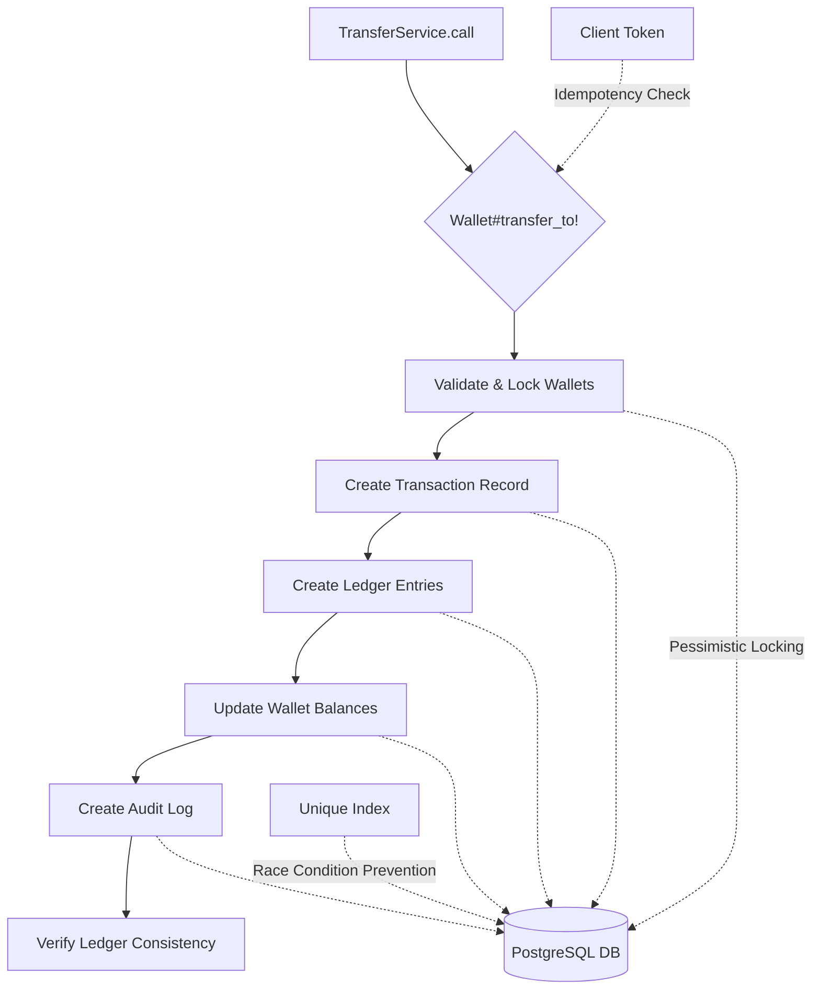

# Lucepay Tx

A robust, production-ready financial transaction engine built with Ruby on Rails, designed for high-concurrency wallet transfers with comprehensive audit trails and idempotency guarantees.

## Overview

Lucepay Tx is a financial transaction processing system that provides:

- **Atomic Wallet Transfers**: Thread-safe money transfers with pessimistic locking
- **Comprehensive Audit Trails**: Complete ledger entries and audit logs for compliance
- **Idempotency Support**: Client token-based duplicate prevention
- **Ledger Consistency**: Automatic verification of financial record integrity
- **Concurrency Safety**: Race condition prevention with proper database locking
- **Production Monitoring**: Extensive logging and consistency checks

## Architecture



### Architecture Components

- **TransferService**: Orchestrates transfer operations with idempotency
- **Wallet Model**: Handles core transfer logic with pessimistic locking
- **LedgerEntry**: Immutable financial records with enum-based entry types
- **AuditLog**: Comprehensive audit trail with JSONB metadata
- **Transaction**: Central record linking all transfer components

## Quickstart

### Prerequisites

- **Ruby 3.2.2**
- **PostgreSQL 13+**
- **Redis** (for future Sidekiq integration)
- **Bundler**

### Installation

1. **Clone and setup:**
   ```bash
   git clone <repository-url>
   cd lucepay_tx
   bundle install
   ```

2. **Database setup:**
   ```bash
   # Create and migrate database
   rails db:create
   rails db:migrate

   # Verify setup
   rails db:seed  # Optional: creates sample data
   ```

3. **Run tests:**
   ```bash
   bundle exec rspec
   ```

4. **Start development server:**
   ```bash
   rails server
   ```

## API Endpoints

### Transfer Money (Planned)

**POST** `/api/v1/transactions`

Creates a new wallet transfer with idempotency support.

**Request Body:**
```json
{
  "from_wallet_id": 1,
  "to_wallet_id": 2,
  "amount_cents": 1000,
  "client_token": "unique-payment-id-123"
}
```

**Sample curl command:**
```bash
curl -X POST http://localhost:3000/api/v1/transactions \
  -H "Content-Type: application/json" \
  -d '{
    "from_wallet_id": 1,
    "to_wallet_id": 2,
    "amount_cents": 1000,
    "client_token": "unique-payment-id-123"
  }'
```

**Response:**
```json
{
  "success": true,
  "transaction_id": 123,
  "message": "Transfer completed successfully"
}
```

### Error Handling

The API provides comprehensive error responses:

```json
{
  "success": false,
  "error": "Insufficient funds",
  "code": "INSUFFICIENT_FUNDS"
}
```

## Development

### Project Structure

```
lucepay_tx/
├── app/
│   ├── models/
│   │   ├── wallet.rb           # Core transfer logic with locking
│   │   ├── transaction.rb      # Transaction records
│   │   ├── ledger_entry.rb     # Financial ledger with enums
│   │   └── audit_log.rb        # Audit trail records
│   └── services/
│       └── wallet/
│           ├── transfer_service.rb  # Service layer with idempotency
│           └── result.rb            # Result pattern implementation
├── spec/                       # Comprehensive RSpec test suite
├── db/migrate/                 # Database migrations
├── doc/adr/                    # Architecture Decision Records
└── .github/workflows/          # CI/CD configuration
```

### Key Features

#### 🔒 Concurrency Safety
- Pessimistic locking with `SELECT ... FOR UPDATE`
- Race condition prevention
- Atomic transaction processing

#### 🧮 Financial Integrity
- Integer-based money calculations (cents)
- Ledger consistency verification
- Comprehensive audit trails

#### ♻️ Idempotency
- Client token-based duplicate prevention
- Safe retry mechanisms
- Race condition handling

#### 📊 Monitoring & Compliance
- Structured audit logs with JSONB metadata
- Ledger consistency checks
- Performance monitoring hooks

## Testing

### Running Tests

```bash
# Run all tests
bundle exec rspec

# Run specific test suites
bundle exec rspec spec/models/
bundle exec rspec spec/services/

# Run with coverage
COVERAGE=true bundle exec rspec

# Run concurrency tests specifically
bundle exec rspec --tag concurrency
```

### Test Coverage

- **Unit Tests**: Model and service method testing
- **Integration Tests**: Full transfer flow validation
- **Concurrency Tests**: 10+ simultaneous transfer simulation
- **Idempotency Tests**: Duplicate request handling
- **Edge Case Tests**: Error conditions and race scenarios

## CI/CD

The project includes a comprehensive GitHub Actions workflow that:

- ✅ Sets up Ruby 3.2.2 environment
- ✅ Provisions PostgreSQL service
- ✅ Installs dependencies with Bundler
- ✅ Runs database migrations
- ✅ Executes full RSpec test suite
- ✅ Validates code quality and security

See `.github/workflows/ci.yml` for complete workflow configuration.

## Architecture Decision Records (ADRs)

### 📋 Available ADRs

1. **[ADR-0001: Locking Strategy](./doc/adr/0001-locking-strategy.md)**
   - Pessimistic vs. optimistic locking analysis
   - Concurrency safety implementation
   - Performance and scalability considerations

2. **[ADR-0002: Idempotency Strategy](./doc/adr/0002-idempotency.md)**
   - Client token-based idempotency design
   - Race condition handling approaches
   - Database vs. application-level solutions

### ADR Format

All ADRs follow the standard format:
- **Context**: Problem statement and requirements
- **Decision**: Chosen solution and implementation
- **Consequences**: Trade-offs and impacts
- **Alternatives**: Considered but rejected options

## Future Improvements

### 🚀 Scalability Enhancements
- **Async Processing**: Sidekiq integration for high-volume transfers
- **Read Replicas**: Database read scaling for audit queries
- **Caching Layer**: Redis-based caching for frequently accessed data
- **Horizontal Scaling**: Multi-instance deployment strategies

### 🔍 Advanced Monitoring
- **Metrics Collection**: Prometheus metrics for transfer performance
- **Distributed Tracing**: Request tracing across service boundaries
- **Alerting**: Proactive monitoring for failed transfers and inconsistencies
- **Dashboard**: Real-time visualization of system health

### 🛡️ Enhanced Security
- **Encryption**: At-rest encryption for sensitive financial data
- **Rate Limiting**: API rate limiting to prevent abuse
- **IP Whitelisting**: Network-level access controls
- **Compliance Reporting**: Automated regulatory reporting

### 🎯 API Enhancements
- **WebSocket Updates**: Real-time transfer status notifications
- **Batch Operations**: Multiple transfers in single request
- **Transfer Scheduling**: Future-dated transfer processing
- **Webhook Notifications**: External system integration

## Contributing

1. **Fork** the repository
2. **Create** a feature branch (`git checkout -b feature/amazing-feature`)
3. **Write** tests for new functionality
4. **Ensure** all tests pass (`bundle exec rspec`)
5. **Commit** changes (`git commit -m 'Add amazing feature'`)
6. **Push** to branch (`git push origin feature/amazing-feature`)
7. **Open** a Pull Request

### Code Standards

- Follow Ruby Style Guide (Rubocop configuration included)
- Write comprehensive RSpec tests for all new features
- Update ADRs for significant architectural changes
- Maintain backward compatibility for API changes

## License

This project is licensed under the MIT License - see the [LICENSE](LICENSE) file for details.

## Support

For questions, issues, or contributions, please:

- 📧 Open an issue on GitHub
- 📚 Review the ADRs for architectural context
- 🧪 Run the test suite to verify local setup
- 📖 Check the API documentation for usage examples

---

**Built with ❤️ using Ruby on Rails 7.1, PostgreSQL, and modern software architecture patterns.**