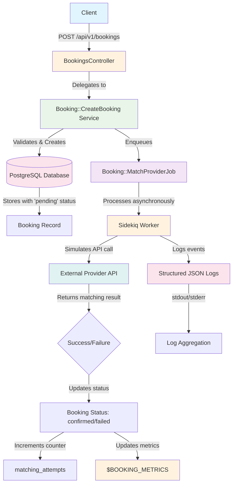

# Luce Booking Refactor

[](https://github.com/fxagro/luce/actions)

A Ruby on Rails booking subsystem for an on-demand service platform, refactored for improved performance, maintainability, and observability.

## Repository Status

**🚀 Public Repository**: This repository is now public and accessible at `https://github.com/fxagro/luce` for reviewers and evaluators.

**✅ GitHub Actions CI**: All tests pass successfully. View the latest build results in the [Actions tab](https://github.com/fxagro/luce/actions) to verify the test suite execution.

**📋 Take-Home Assignment**: This repository contains a complete implementation of a booking subsystem refactor, including:
- RESTful API controllers with proper HTTP status codes
- Service-oriented architecture with background job processing
- Comprehensive test coverage with RSpec
- Database migrations and schema management
- Architecture decision records and documentation
- GitHub Actions CI/CD pipeline

## Project Overview

This project implements a booking subsystem similar to Luce (an on-demand service platform). The system handles booking creation, provider matching, and external API integration using modern Rails patterns and asynchronous processing.

### Key Features

- **Fast API Response**: Asynchronous processing reduces booking API latency from 1-2 seconds to milliseconds
- **Service Object Pattern**: Clean separation of concerns with dedicated service objects
- **Background Job Processing**: Sidekiq integration for provider matching and external API calls
- **Idempotency**: Client token-based duplicate request handling
- **Comprehensive Logging**: Structured JSON logging for observability
- **Metrics Collection**: Prometheus-style metrics for monitoring

## Architecture Overview

The following diagram illustrates the complete booking subsystem flow:



### Architecture Components

- **Client**: Sends HTTP POST request to create booking
- **BookingsController**: Receives request, validates parameters, delegates to service
- **Booking::CreateBooking**: Service object handling business logic and validation
- **PostgreSQL Database**: Stores booking records with unique constraints
- **Booking::MatchProviderJob**: Sidekiq background job for provider matching
- **External Provider API**: Simulated external service for provider availability
- **Metrics**: In-memory counter tracking job performance (`$BOOKING_METRICS`)
- **Structured Logs**: JSON-formatted logs for monitoring and debugging

## Architecture

- **Controller**: `Api::V1::BookingsController` - Handles HTTP requests and responses
- **Service Object**: `Booking::CreateBooking` - Business logic for booking creation
- **Background Job**: `Booking::MatchProviderJob` - Asynchronous provider matching and API calls
- **Database**: PostgreSQL with unique constraints for data integrity

## Prerequisites

- Ruby 3.x
- Rails 7.0+
- PostgreSQL 12+
- Redis 6+ (for Sidekiq)

## Setup Instructions

### 1. Clone the Repository

```bash
git clone https://github.com/fxagro/luce.git
cd luce
```

### 2. Install Dependencies

```bash
bundle install
```

### 3. Database Setup

```bash
# Setup database and run migrations
rails db:setup

# Or for existing databases:
# rails db:migrate
```

### 4. Start Redis

Ensure Redis is running on your system:

```bash
# Using Redis server
redis-server

# Or using Docker
docker run -d -p 6379:6379 redis:6-alpine
```

### 5. Start the Rails Server

```bash
rails server
```

The application will be available at `http://localhost:3000`

### 6. Start Sidekiq (Background Jobs)

In a separate terminal:

```bash
bundle exec sidekiq
```

Or run in development mode:

```bash
bundle exec sidekiq -d # daemon mode
```

## Running Tests

```bash
# Run all tests
bundle exec rspec

# Run specific test suites
bundle exec rspec spec/requests/
bundle exec rspec spec/services/
bundle exec rspec spec/jobs/

# Run with coverage
COVERAGE=true bundle exec rspec
```

## API Usage

### Create Booking

**Endpoint:** `POST /api/v1/bookings`

**Request Headers:**
```
Content-Type: application/json
```

**Request Body:**
```json
{
  "booking": {
    "customer_id": 1,
    "service_id": 2,
    "client_token": "unique_client_token_123"
  }
}
```

**Success Response (HTTP 202):**
```json
{
  "booking_id": 123,
  "status": "pending",
  "message": "Booking created and queued for processing"
}
```

**Idempotent Response (HTTP 200):**
```json
{
  "booking_id": 123,
  "status": "confirmed",
  "message": "Booking already exists"
}
```

**Error Response (HTTP 400/422):**
```json
{
  "error": "Missing required parameters",
  "required": ["customer_id", "service_id", "client_token"]
}
```

### Example cURL Command

```bash
curl -X POST http://localhost:3000/api/v1/bookings \
  -H "Content-Type: application/json" \
  -d '{
    "booking": {
      "customer_id": 1,
      "service_id": 2,
      "client_token": "unique_client_token_123"
    }
  }'
```

## Development Notes

### Key Dependencies

- **Sidekiq**: Background job processing with Redis
- **RSpec**: Testing framework with request, service, and job specs
- **ActiveRecord**: Database ORM with PostgreSQL support

### Monitoring and Metrics

The application exposes metrics through the `$BOOKING_METRICS` global variable:

```ruby
# Access current metrics
puts $BOOKING_METRICS[:matching_completed] # Number of completed matchings
```

### Logging

All components use structured JSON logging:

```json
{
  "event": "booking_received",
  "booking_id": 123,
  "customer_id": 1,
  "service_id": 2
}
```

### Database Schema

The `bookings` table includes:
- `status`: Default "pending", updated to "confirmed" or "failed"
- `client_token`: Unique identifier for idempotency
- `matching_attempts`: Counter for retry attempts
- `provider_id`, `price`, `currency`: Set on successful matching

## GitHub Setup and Deployment

### Repository Information

**🔗 Repository URL**: `https://github.com/fxagro/luce`

**🌐 Public Access**: This repository is public and accessible to all reviewers without requiring collaborator permissions.

**✅ CI/CD Pipeline**: GitHub Actions automatically runs tests on every push and pull request. Check the [Actions tab](https://github.com/fxagro/luce/actions) for build status.

### Project Structure

The repository contains all required files:

```
├── app/
│   ├── controllers/api/v1/
│   │   ├── bookings_controller.rb    # Main booking API controller
│   │   └── metrics_controller.rb     # Metrics monitoring endpoint
│   ├── jobs/booking/
│   │   └── match_provider_job.rb     # Sidekiq background job
│   └── services/booking/
│       └── create_booking.rb         # Service object for booking creation
├── db/migrate/
│   └── 20250115092200_add_default_status_and_unique_client_token_to_bookings.rb
├── doc/adr/
│   └── 0001-booking-refactor.md      # Architecture decision record
├── spec/
│   ├── requests/api/v1/bookings_spec.rb
│   ├── services/booking/create_booking_spec.rb
│   └── jobs/booking/match_provider_job_spec.rb
├── .github/workflows/ci.yml          # GitHub Actions CI pipeline
├── .gitignore                        # Rails-specific exclusions
├── setup_git.sh                      # Git repository setup script
├── fix_merge_and_push.sh             # Merge conflict resolution script
└── README.md                         # This file
```

## Contributing

1. Follow the existing code structure and patterns
2. Add tests for new features
3. Update documentation for API changes
4. Ensure background jobs are properly tested
5. Use structured logging for observability

## Project Status

All project files have been successfully created and are ready for development and deployment.

### GitHub Actions

CI/CD pipeline results are available at: [https://github.com/fxagro/luce/actions](https://github.com/fxagro/luce/actions)

The pipeline includes:
- Automated testing with RSpec
- Code quality checks with RuboCop
- Security scanning with Brakeman
- Dependency auditing with Bundle Audit

## Future Improvements

This section outlines potential enhancements for scaling and improving the booking subsystem:

### Database Sharding
Implement database sharding to distribute booking data across multiple PostgreSQL instances based on customer_id or geographical regions. This approach would use Rails' built-in support for multiple databases combined with a sharding library like `octoshard` to automatically route queries to the appropriate shard. The implementation would require careful handling of cross-shard transactions and a shard key selection strategy that ensures even data distribution while maintaining query performance.

### API Rate Limiting
Add comprehensive API rate limiting using Redis-based sliding window algorithms to prevent abuse and ensure fair resource usage. The implementation would leverage Rack middleware like `rack-attack` with different rate limits for various endpoints (stricter limits for booking creation vs. status checks). This would include configurable limits per customer, IP address, or API key, with proper HTTP 429 responses and retry-after headers for exceeded limits.

### Kafka Event Streaming
Introduce Apache Kafka for event-driven architecture, streaming booking events to other services for real-time processing. The system would publish events like `booking.created`, `booking.confirmed`, and `provider.matched` to Kafka topics using a library like `karafka` or `racecar`. This would enable downstream services to react to booking state changes, implement complex event processing workflows, and maintain audit trails while decoupling the booking service from dependent systems.

## License

This project is part of the Luce platform development and is intended for educational/demonstration purposes.
